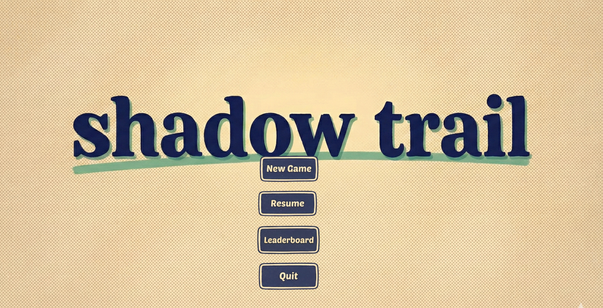
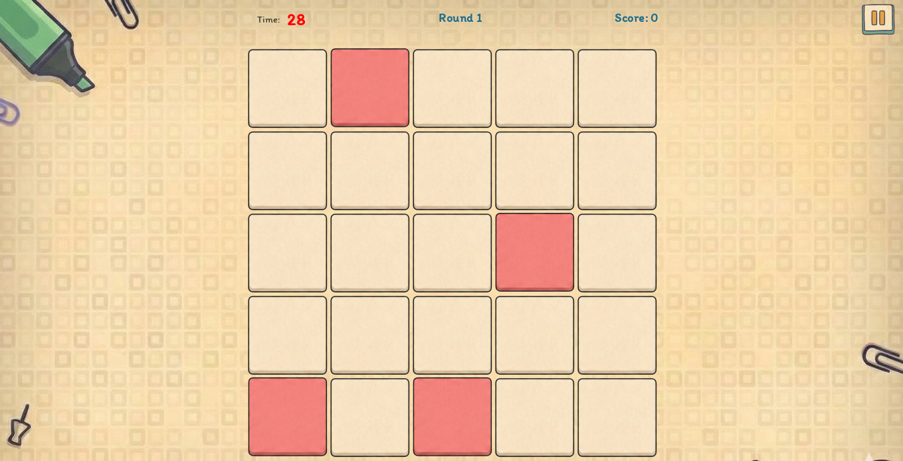
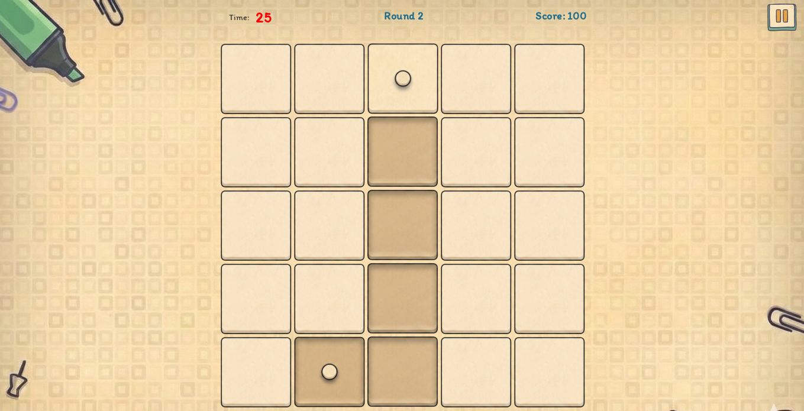

# ShadowTrail

ShadowTrail is a simple grid-based puzzle game built as a learning project to explore GUI development in Java using Swing. The game challenges players to connect two safe points while avoiding dangerous tiles that are randomly generated, making each level feel a bit different.

**Menu utama**

**Pilih profil / permainan baru**

**Papan level**

**Gameplay**

